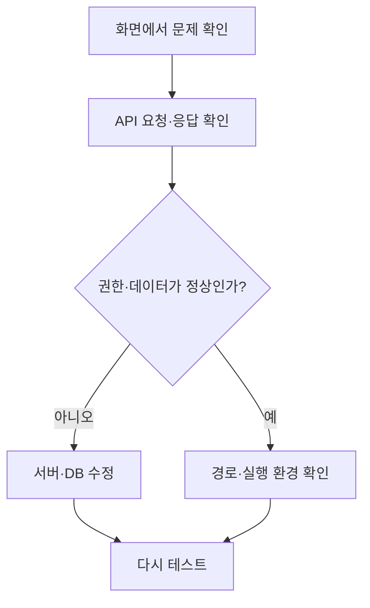

<div align="center">

<a href="https://git.io/typing-svg"></a>

<p>
Java와 Spring Boot를 중심으로 서버 개발을 공부하고 있습니다.<br>
기능이 동작하는 데서 멈추지 않고, 화면·API·DB가 같은 기준으로 연결되는지 확인하며 개발합니다.<br>
프로젝트에서는 권한, 저장, 이미지 경로처럼 실제 사용 중 생길 수 있는 문제를 직접 찾아 고쳤습니다.
</p>

<a href="https://github.com/dabinah9526-ship-it"></a>
<a href="mailto:dabinah26@naver.com"></a>

<br>


<br><br>

<a href="#tech-stack">STACK</a> ·
<a href="#dev-flow">DEV FLOW</a> ·
<a href="#projects">PROJECTS</a> ·
<a href="#troubleshooting">TROUBLESHOOTING</a> ·
<a href="#github-activity">GITHUB</a> ·
<a href="#about-me">ABOUT</a>

</div>

```java
Developer dabin = Developer.builder()
    .role("Backend Developer")
    .focus("Java · Spring Boot · Database · API")
    .habit("화면 → API → DB까지 확인")
    .build();
```

<details>
<summary><code>$ java Dabin.java</code>　<b>개발자 정보 실행하기</b></summary>

```text
이름      이다빈
관심 분야  Backend · Database · API
개발 습관  기능이 실제 사용 조건에서도 제대로 동작하는지 끝까지 확인
현재 상태  새로운 문제를 만나며 계속 배우는 중
```

</details>

---

<a id="tech-stack"></a>

## 01 / TECH STACK

<div align="center">


<br><br>


</div>

<details>
<summary><b>기술을 분야별로 보기</b></summary>

### Backend

- Java, Spring Boot, MyBatis
- Node.js, Express

### Database

- Oracle, MySQL
- Firebase Auth, Firestore, Firebase Storage

### Frontend & Mobile

- JavaScript, React, Vue.js
- Flutter, Dart

### Tools

- Git, GitHub, Postman

</details>

---

<a id="dev-flow"></a>

## 02 / DEV FLOW

화면에서 보이는 현상만 고치지 않고, 문제가 시작된 지점까지 따라가며 확인합니다.



<details>
<summary><b>이 흐름으로 해결한 문제 보기</b></summary>

- K-STEP: 피드·이미지·여행 장소가 일부만 저장될 수 있는 문제
- UNIPET: 공백과 특수문자로 금칙어 필터를 피하는 문제
- 따iT: 타이머 화면 갱신으로 생긴 버벅임과 시간 표시 문제

</details>

---

<a id="projects"></a>

## 03 / PROJECTS

프로젝트 이름을 누르면 대표 구현과 전체 기능, 코드 링크가 펼쳐집니다.

| 프로젝트 | 형태 | 맡은 부분 | 주요 기술 |
|:---|:---:|:---|:---|
| **K-STEP** | 개인 | 기획, DB, API, 화면 연동 | React, Express, Oracle |
| **UNIPET** | 팀 | 쇼핑몰, 커뮤니티 | Spring Boot, MyBatis, MySQL |
| **따iT** | 팀 | 스터디, 커뮤니티 | Flutter, Firebase |

<br>

<details>
<summary><code>P01</code> <b>K-STEP</b> — 한국 여행 SNS</summary>

<br>

한국 여행 사진과 장소, 이동 루트를 기록하고 공유하는 개인 프로젝트입니다.

`2026.05.27 ~ 2026.06.09` · `1인 개발`

**담당**　기획, DB 설계, API 개발, React 화면 및 서버 연동  
**기술**　React, Node.js, Express, Oracle, JWT, bcrypt, Multer

### 대표 구현

- JWT 인증과 bcrypt 암호화를 적용하고 회원·프로필 기능을 연결했습니다.
- 피드, 이미지, 여행 장소 저장을 하나의 트랜잭션으로 묶어 데이터가 일부만 남지 않도록 처리했습니다.
- 비공개 계정, 팔로우, 차단 상태를 화면뿐 아니라 서버에서도 확인하도록 만들었습니다.
- 피드부터 스토리, 채팅, 알림까지 SNS의 주요 흐름을 직접 구현했습니다.

<details>
<summary><b>전체 구현 기능 펼쳐보기</b></summary>

#### 회원 및 인증

- 회원가입 및 로그인
- JWT 기반 사용자 인증
- bcrypt 비밀번호 암호화
- 아이디·닉네임 중복 확인
- 아이디 및 비밀번호 찾기
- 프로필 조회·수정
- 비공개 계정 설정
- 사용자 차단 및 차단 해제

#### 여행 피드

- 피드 작성·수정·삭제
- 피드 목록 및 상세 조회
- 다중 이미지 업로드
- 지역·카테고리·해시태그 검색
- 여행 장소 및 이동 순서 저장
- 팔로우한 사용자 피드 조회
- 비공개 계정의 피드 조회 제한
- 차단한 사용자와 차단당한 사용자의 피드 제외

#### 댓글 및 사용자 활동

- 댓글 작성·수정·삭제
- 좋아요 등록·취소
- 여행 루트 저장·취소
- 팔로우·팔로우 취소
- 비공개 계정의 팔로우 요청
- 팔로우 요청 수락·거절
- 댓글·좋아요·팔로우 알림

#### 스토리 및 채팅

- 스토리 등록·조회·삭제
- 본 스토리와 보지 않은 스토리 구분
- 스토리 조회자 목록
- 채팅방 생성
- 메시지 전송
- 나에게만 메시지 삭제
- 모든 사용자에게 메시지 삭제
- 사용자 접속 상태 확인

#### 서버 처리

- 피드·이미지·여행 장소를 같은 DB 커넥션에서 저장
- 전체 저장 성공 시 `commit`
- 오류 발생 시 `rollback`
- 사용한 Oracle 커넥션을 `finally`에서 반환
- 비공개·팔로우·차단 상태를 서버에서 확인
- 로그인 사용자에 따라 좋아요·저장 여부를 함께 응답

</details>

### 코드 보기

[`Repository`](https://github.com/dabinah9526-ship-it/react_project_kstep) ·
[`Express API`](https://github.com/dabinah9526-ship-it/react_project_kstep/tree/main/express-back/routes) ·
[`React UI`](https://github.com/dabinah9526-ship-it/react_project_kstep/tree/main/react-front/src) ·
[`Oracle DB`](https://github.com/dabinah9526-ship-it/react_project_kstep/tree/main/kstep_db_backup)

</details>

<br>

<details>
<summary><code>P02</code> <b>UNIPET</b> — 반려동물 통합 플랫폼</summary>

<br>

반려동물 쇼핑, 커뮤니티, 병원·미용실·호텔링 예약 기능을 제공하는 팀 프로젝트입니다.

`2026.04.09 ~ 2026.04.30` · `5인 팀 프로젝트`

**담당**　쇼핑몰, 커뮤니티  
**기술**　Java, Spring Boot, MyBatis, MySQL, JSP, jQuery, JavaScript

### 대표 구현

- 상품 목록·상세·장바구니·찜·상품평까지 쇼핑몰 흐름을 구현했습니다.
- 게시글과 댓글의 등록·수정·삭제, 검색·정렬·페이징을 연결했습니다.
- 작성자와 관리자 권한을 화면과 서버에서 함께 확인하도록 수정했습니다.
- 공백과 특수문자로 금칙어 필터를 피하는 문제를 정규식과 공통 메서드로 개선했습니다.

<details>
<summary><b>전체 구현 기능 펼쳐보기</b></summary>

#### 쇼핑몰

- 상품 목록 및 상세 페이지
- 상품 카테고리 필터
- 가격 및 추천 대상 필터
- 최신순·가격순·리뷰순·평점순 정렬
- 장바구니 상품 추가·수량 변경·삭제
- 상품 찜 등록·해제
- 상품평 작성·수정·삭제
- 이미지 상품평 슬라이드
- 작성자와 관리자에 따른 버튼 권한 구분

#### 커뮤니티

- 통합·지역 게시판
- 게시글 목록 및 상세 조회
- 게시글 작성·수정·삭제
- 게시판 카테고리 및 지역 필터
- 게시글 검색·정렬·페이징
- 공지사항
- 비공개 게시글
- 게시글 임시저장
- 게시글 첨부파일
- 댓글 작성·수정·삭제
- 게시글 추천·신고·알림

#### 금칙어 필터 개선

- 정확히 일치하는 단어만 걸러지던 문제 확인
- 공백과 특수문자가 포함된 표현도 찾도록 정규식 적용
- 게시글 제목·본문·댓글에 공통 필터 적용
- 금칙어 목록을 `BAD_WORD` 테이블로 이동
- MyBatis를 통해 활성화된 금칙어만 조회
- 코드 수정 없이 DB에서 금칙어 추가 및 사용 여부 관리

#### 회원 권한 처리

- 공지사항은 관리자만 작성·삭제
- 일반회원 화면에서 공지 작성 버튼 숨김
- 상품평 작성자만 수정·삭제 가능
- 관리자는 상품평 삭제만 가능
- 화면의 버튼 조건과 서버 권한 조건을 함께 수정

</details>

### 코드 및 커밋 보기

[`Repository`](https://github.com/Medo-skb/Unipet) ·
[`상품 UI`](https://github.com/Medo-skb/Unipet/tree/main/unipet/src/main/webapp/WEB-INF/product) ·
[`커뮤니티 UI`](https://github.com/Medo-skb/Unipet/tree/main/unipet/src/main/webapp/WEB-INF/board) ·
[`MyBatis SQL`](https://github.com/Medo-skb/Unipet/tree/main/unipet/src/main/resources/mybatis-mapper)

</details>

<br>

<details>
<summary><code>P03</code> <b>따iT</b> — 자격증 학습 관리 Flutter 앱</summary>

<br>

자격증 일정 관리와 스터디, 커뮤니티 기능을 제공하는 모바일 팀 프로젝트입니다.

`개발 진행 중` · `기능 브랜치 개발 및 Pull Request`

**담당**　스터디, 커뮤니티  
**기술**　Flutter, Dart, Firebase Auth, Firestore, Firebase Storage

### 대표 구현

- 스터디 생성부터 참여 신청, 수락·거절까지 참여 흐름을 연결했습니다.
- 방장·매니저·일반회원 권한을 나누고 초대·신고·추방 기능을 구현했습니다.
- 일반·포모도로 타이머와 과목별 공부 기록, 누적 시간 저장 기능을 만들었습니다.
- 실시간 그룹 채팅과 사진·파일 전송, OX·객관식·주관식 문제 기능을 구현했습니다.
- 커뮤니티에 실시간 목록, 검색·필터·정렬, 작성자 권한과 상태 변경 방식의 삭제를 적용했습니다.

<details>
<summary><b>전체 구현 기능 펼쳐보기</b></summary>

#### 스터디 생성 및 참여

- 스터디 목록 실시간 조회
- 모집 상태별 필터
- 공개·비공개 스터디 구분
- 키워드 검색
- 스터디 생성·수정
- 스터디 상세 조회
- 목표 시험일 및 모집 인원 설정
- 즉시 참여와 승인 후 참여 구분
- 참여 신청 수락·거절

#### 그룹 관리

- 방장·매니저·일반회원 권한 구분
- 그룹원 목록
- 공부 시간 순위
- 회원 초대
- 그룹원 신고
- 그룹원 추방
- 스터디 나가기
- 스터디 삭제
- 관련 하위 컬렉션 삭제

#### 공부 기록

- 일반 타이머
- 포모도로 타이머
- 시작·일시정지·재시작·종료
- 과목 추가·수정·삭제
- 과목별 공부 시간 저장
- 일자별 공부 기록 저장
- 오늘 공부 시간 표시
- 누적 공부 시간 표시
- 앱 이탈 횟수를 이용한 집중 점수
- 시험일까지의 D-Day
- 목표 공부 시간 달성률
- 스터디원 공부 시간 순위

#### 그룹 채팅 및 문제

- 실시간 그룹 채팅
- 작성자와 전송 시간 표시
- 메시지 답장
- 방장 공지 작성
- 사진 업로드
- 파일 업로드
- 업로드 진행률 표시
- OX 문제 등록
- 객관식·주관식 문제 등록
- 문제 전송 및 답안 확인

#### 커뮤니티

- 게시판 종류별 게시글 조회
- Firestore 실시간 목록 조회
- 게시글 상세 조회
- 게시글 작성·수정·삭제
- 문서를 완전히 지우지 않는 상태 변경 방식의 삭제
- 제목·내용·작성자 검색
- 자격증 태그 필터
- 최신순·조회순·좋아요순·댓글순 정렬
- 인기 게시글 표시
- 로그인 사용자 확인
- 작성자에 따른 수정·삭제 권한 처리

</details>

### 코드 및 커밋 보기

[`Repository`](https://github.com/4288-yerim/flutterteam03) ·
[`스터디 코드`](https://github.com/4288-yerim/flutterteam03/tree/dev/lib/study) ·
[`커뮤니티 코드`](https://github.com/4288-yerim/flutterteam03/tree/dev/lib/community)

</details>

---

<a id="troubleshooting"></a>

## 04 / TROUBLESHOOTING

<details>
<summary><code>FIX-01</code> <b>K-STEP</b> — 여러 테이블의 저장 결과가 어긋날 수 있는 문제</summary>

### 어떤 문제였나

피드 하나를 등록할 때 기본 내용은 `FEED`, 이미지는 `FEED_IMAGE`, 여행 장소는 `ROUTE_SPOT`에 각각 저장됩니다. 중간에 오류가 나면 피드만 저장되고 이미지나 장소가 빠지는 상황이 생길 수 있었습니다.

### 어떻게 고쳤나

세 저장 작업이 같은 Oracle 커넥션을 사용하도록 묶었습니다. 모든 작업이 정상적으로 끝난 경우에만 `commit`하고, 하나라도 실패하면 전체를 `rollback`했습니다. 마지막에는 `finally`에서 커넥션을 반환하도록 처리했습니다.

> **부분 저장 위험 → 하나의 트랜잭션으로 묶어 데이터 정합성 유지**

</details>

<details>
<summary><code>FIX-02</code> <b>UNIPET</b> — 공백과 특수문자로 금칙어 필터를 피하는 문제</summary>

### 어떤 문제였나

금칙어와 정확히 일치하는 표현만 걸러져서 글자 사이에 공백이나 특수문자를 넣으면 필터를 통과했습니다.

### 어떻게 고쳤나

글자 사이의 공백과 특수문자까지 인식하도록 정규식을 적용했습니다. 같은 로직을 게시글 제목·본문·댓글에서 사용할 수 있도록 공통 메서드로 분리했고, 금칙어 목록은 `BAD_WORD` 테이블에서 관리하도록 바꿨습니다.

> **정확히 일치하는 표현만 차단 → 공백·특수문자 우회까지 확인**

</details>

<details>
<summary><code>FIX-03</code> <b>따iT</b> — 타이머 버벅임과 시간 표시 문제</summary>

### 어떤 문제였나

타이머가 동작하는 동안 화면이 너무 자주 갱신돼 버벅였고, 내부의 초 단위 값과 화면에 보이는 분·초가 맞지 않는 경우가 있었습니다.

### 어떻게 고쳤나

매초 전체 화면을 다시 그리지 않도록 갱신 범위를 줄였습니다. 내부 계산은 초 단위로 유지하고, 사용자에게 보여주는 시간 형식은 따로 변환했습니다. 타이머가 끝난 뒤에는 공부 기록과 누적 시간을 Firestore에 저장하도록 연결했습니다.

> **매초 전체 화면 갱신 → 필요한 부분만 갱신하고 시간 계산과 표시를 분리**

</details>

---

<a id="github-activity"></a>

## 05 / GITHUB ACTIVITY

<details>
<summary><b>GitHub 활동 카드 펼쳐보기</b></summary>

<br>

<div align="center">


</div>

</details>

---

<a id="about-me"></a>

## 06 / ABOUT ME

<details>
<summary><code>HISTORY</code> <b>개발을 시작하기 전 경험</b></summary>

<br>

- 러시아에서 고등학교와 대학교 졸업
- 해외 법인 운영 및 경영지원
- 러시아어 통번역 및 해외 업무 지원
- 한국 화장품 유통 회사 운영
- 외국인 환자 입국·진료 지원
- 러시아어 의료통역

개발 전에는 여러 업무의 처음부터 끝까지 직접 챙겼습니다. 그때 생긴 확인 습관이 지금은 화면만 보지 않고 서버와 DB까지 따라가며 문제를 찾는 방식으로 이어졌습니다.

</details>

---

<div align="center">

### CONTACT

[](mailto:dabinah26@naver.com)
[](https://github.com/dabinah9526-ship-it)

<br>

<code>// 기능보다 흐름을, 화면보다 전체 연결을 확인합니다.</code>

</div>
